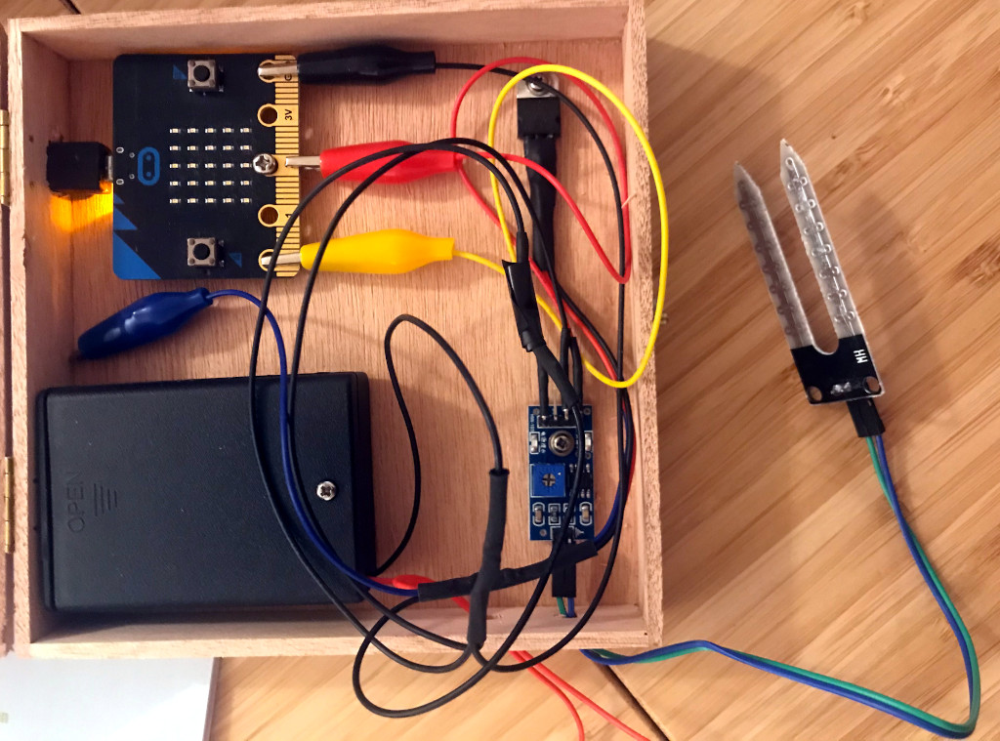
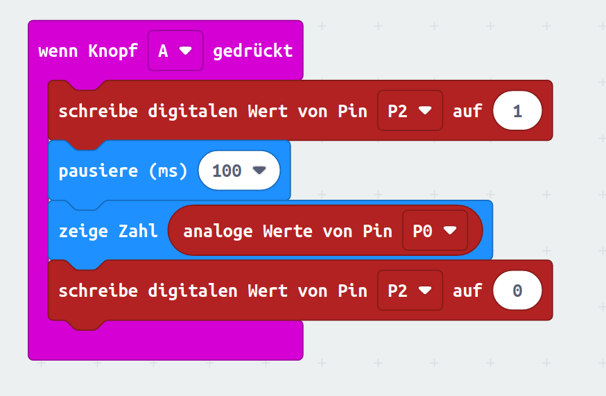

# Automatische Bewässerung mit dem Micro:bit

Eine (halb-) automatische Bewässerungsanalge hilft dabei, dass deine Pflanzen nicht verdursten. 

## Materialliste

Bewässerungskit
- Wasserpumpe
- Schlauch
- Feuchtigkeitssensor (Sensor + Chip)
- Batteriebox für 3 AA Batterien mit Kontakten für micro:bit, Feuchtigkeitssensor und Pumpe
- Transistor mit Kontakten für micro:bit, Feuchtigkeitssenor und Pumpe
- Gelbes und rotes Kabel mit Krokodilklemme um micro:bit und Feuchtigkeitssenor zu verbinden

Außerdem (aus dem Starterset): 
- micro:bit 
- USB-Kabel
- Batteriebox für 2 AA Batterien

## Der Feuchtigkeitssensor

Wenn die Erde trocken ist muss man gießen, aber woher soll der micro:bit wissen, wann es soweit ist? Der Chip kann Feuchtigkeit nicht direkt wahrnehmen, wir brauchen einen Feuchtigkeitssenor. Dieser Sensor nutzt die Tatsache, dass feuchte Erde den Strom besser leitet als trockene und der micro:bit übersetzt diese Leitfähigkeit dann in eine Zahl zwischen 0 und 1024: 1024 bedeutet dass kein Strom fließt, 0 misst man bei einem perfekten Leiter. 

### Schaltplan

Das gelbe Kabel verbindet A0 des Feuchtigkeitssensors mit dem 0-Pin des micro:bit. Das rote Kabel verbindet VCC des Feuchtigkeitssensors mit dem 2-Pin des micro:bit. 
Das schwarze Kabel mit der Krokodilklemme vom Batteriefach wird mit GND des micro:bit verbunden. Ein weiteres schwarzes Kabel wird mit GND des Feuchtigkeitssensors verbunden.

### Programmieren

### Aufgabe

Ermittle die Messwerte für die folgenden Stoffe:

- Luft
- Leitungswasser
- Salzwasser
- trockene Erde
- feuchte Erde

Notiere die Ergebnisse für den Aufbau der Anlage.

## Die halbautomatische Bewässerungsanlage

### Schaltplan

### Programmieren

## Die automatische Bewässerungsanlage

### Schaltplan

### Programmieren

## Quellen

[Original (dänisch)](https://www.myarduino.dk/produkt/vandingssaet-til-microbit/)